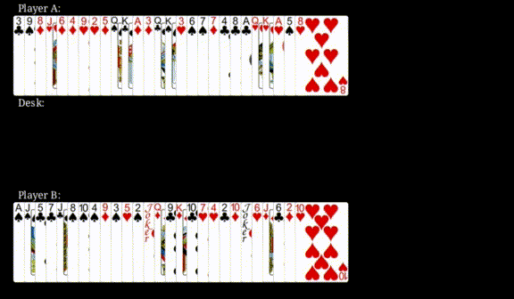
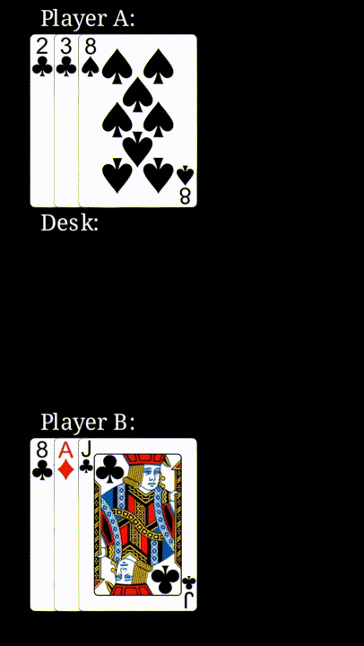
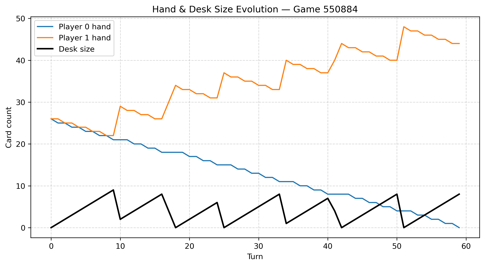
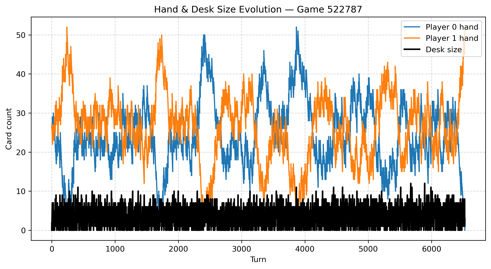
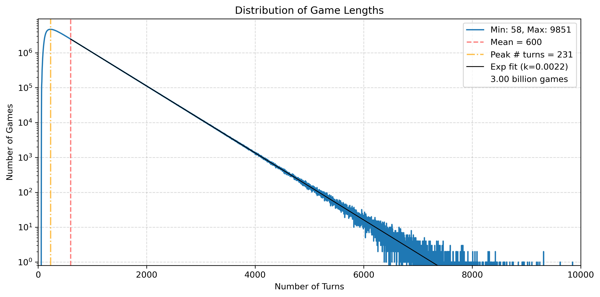
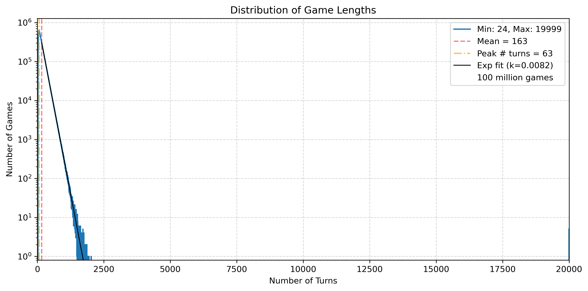

# card-game-simulation-analysis
This project simulates a turn-based deterministic card game using Python and analyzes the results to answer mathematical questions about game properties and fairness.<br/>



## Motivation
I came across the card game "拉火车" ("Pulling the train"), which is popular in china. It is a turn-based fully deterministic card game for 2 or more players. This game can last so long that people sometimes play it over the course of a few days. However, most of the time it ends after less than 15min. With this wide span of game duration I wondered: **Do all games end, or is it possible to get stuck in a loop?** This is a reasonable question, since the game is deterministic and players have no influence on the outcome. This simple question led to a few more questions, which I attempt to answer within this project. Some answers I found surprised me.

The questions:
1. How many possible unique games exist?
2. What does the distribution of number of turns for games look like?
3. How short is the shortest possible game?
4. Can a game go on for ever, or do all possible games end?
5. If all games end within a finite amount of turns, what is the longest possible game?

## Project Structure
- `results_data/`: generated data (please add folder manually)
- `results_plots/`: generated plots (please add folder manually)
- `additional_scripts/`: logger and animator scripts and data <br/>
All other scripts should stay in the main folder modularized_version_2026.

## Tools
- Python
- NumPy, Pandas
- Matplotlib
- Manim (optional for animations)
- A few other packages

## How to Run
If not yet installed, install needed Python packages.

Now you can configure the simulation in `config.py` and run `main.py` for simulations or `game_logger.py` for logging a specific game.

The script `game_animator.py` can be used to animate games with the package Manim. On Linux I created a new environment to install Manim and a specific version of Python, separated from my main system. If you want to run this script make sure to install Manim in your prefered way first.<br/>
In `game_animator.py`, configure as instructed in the comments there. Then you can create animations (mp4):<br/>
Quick low quality:<br/>
`manim -pql game_animator.py CardGame`<br/>
Slower high quality:<br/>
`manim -pqh game_animator.py CardGame`<br/>

## Key Results
These are the key results of the analysis (detailed explanations can be found further down):<br/>
1. The distribution of game lengths follows a straight line in a log-plot (exponential behaviour). Longer games get less and less frequent. Games appear to last between 56 and possibly > 10,000 turns.
2. The game is very fair, but not perfectly. The starting player consistently has a slightly lower winning chance (49.4%) than the second player.
3. The shortest possible game is demonstrated to last 56 turns.
4. Endlessly looping games have not been found for two players and a standard deck of cards, but they seem possible. However, they would be very rare if they exist. For smaller decks of cards endless games were found, but no mathematical proof was found, that this is also possible for a standard deck and two players.

## Future Improvements
- Improve simulation speed
- Implement SQLite for data management
- Increase user-friendliness
- Try machine learning methods to look for patterns that predict the winner or game duration
- Possibly develop graphical app for simulation, visualization and analysis

## Detailed Analysis
In this section the game rules are explained and the data analysis and simulation methods are presented in detail.

### Game Rules:
A deck of 54 cards (including 2 jokers) is shuffled and distributed as evenly as possible to the players. Each player keeps their cards (hand) face down as a pile.<br/>
Players play one card per turn from the top of their pile (moving clockwise). The played card gets added face up onto the row of previously played cards (in playing order). All cards are visible at all times. If the value (suit is irrelevant) of a played card matches that of a card in the row, the player who played that (last) card takes both these cards and all cards between them. Keeping their order, they are added to the bottom of that players hand. It is now that players turn again. A joker can only match with the other joker (jokers are regarded to have their own value). When a player played their last card and cannot gain any cards, that player is out of the game. The game continues until only one player is left with cards on their hand. That player wins the game.<br/>

Simple demo game gif with only a few cards (loading may take a minute):<br/>



The following analysis is done for games with exactly **two players**.

### Q1: How many possible unique games exist?
We assume that player A always plays a card first. Each game and its outcome is then uniquely defined by the initial hands of each player. Since both hands are fully and uniquely dependent on the initial shuffled deck of cards, the shuffled deck determines the outcome of a game. The number of possible unique games is then simply the number of unique permutations of a deck of cards. We have cards 2-10 plus J, Q, K, A, in four suits each, and two jokers, constituting a deck of 54 cards. The number of possible permutations (unique ways to order elements) for 54 elements is<br/>
$54! \sim 2.3 \times 10^{71}$.<br/>
In this game the suits are irrelevant, so we can calculate the number of permutations ignoring the suits:<br/>
$\frac{54!}{4!^{13} \times 2!} \sim 1.3 \times 10^{53}$<br/>
(13 ranks appear 4 times each, jokers appear twice). 

However, with this method we are still over-counting possible game structures in a way: Suppose we have a given shuffled deck. If we now swap all "2"s with all "5"s for example, the resulting game structure remains unchanged since the specific values of the cards are irrelevant. Only the interaction between cars with the same value matters, no matter the concrete value. Therefore, if two or more values are swapped, the structure of the game doesn't change. If we only want to count truly unique game structures, the above derived number needs to be divided by the number of possible ways to swap values with each other:<br/>
$\frac{54!}{4!^{13} \times 2! \times 13!} \sim 2.1 \times 10^{43}$

Now, this number is smaller than the previous one, but still beyond any number of games we could efficiently simulate. As a result we cannot check all possible games and have to rely on other methods to answer some of the posed questions. As it turns out, some questions can quite easily be answered, while some other questions may still remain open until someone finds a mathematical proof (or some other sufficient argument).


### Q2: What does the distribution of number of turns for games look like?
For a given initial shuffled deck it seems impossible to efficiently estimate the resulting game length or the winner. Especially for long games it can go back and forth, which player seems to be winning (see the following figures showing the number of cards on the desk and in each players hand throughout a short and a long game).<br/>




Therefore it seems not unreasonable to firstly try it with brute force: We can simulate billions of games and count the number of turns until a win for each one. Then, we plot a distribution graph to get a visual impression of how many games last how long. For this I wrote a simulation script (described in a later section) and ran a few billion simulations.<br/>



The y-axis (turn count) is set to logarithmic scale to make the plot more readable. In this representation, the distribution of games takes the shape a surprisingly straight line. Being a logarithmic plot, this means that the distribution can be estimated well by an exponential:<br/>
$y \approx A \times \exp{(-0.0022x)}$<br/>
where y is the turn count and x the number of turns.

To answer the question, we can interpret the plot:<br/>
By far most games end after less than 1000 turns. Longer games get increasingly more rare with increasing turn count. This is a purely empirical observation with no theoretical model behind it to explain the origin of this distribution.

3 billion simulated games might seem like a big number, but comparing this to the total number of possible games $\sim 2.1 \times 10^{43}$ we only covered about $1.4 \times 10^{-32}$% of them (basically nothing). One can also argue that for each game we apply a new independent random shuffle to the deck, so it is possible that some permutations are included multiple times. However, this is extremely unlikely given the astronomically big number of possible permutations.

This result provides us with interesting insights to the length of games, but it cannot definitively answer the following questions about the longest and shortest possible games, nor can it prove that all games end in a finite amount of turns. It can indeed tell us, that if endless games exist, they are extremely rare.<br/>
One could estimate the maximum number of turns by applying the following assumption:<br/>
When assuming that the distribution remains linear in a log-plot, the maximal turn count can be estimated by scaling up the found results to the total number of possible games (shift up the distribution until it covers $\sim 2.1 \times 10^{43}$ simulated games and then get the x value for y = 1). **This predicts a game with 44,860 (about 45 thousand) turns to be the longest**. However, this result should **NOT** be convincing evidence to you, since there is no apparent reason to assume that the distribution stays linear (in log scale), going to higher turn counts. It could look very different or even have some hard cutoff due to the properties of the game.

For smaller decks of cards in many cases endless games have been found by simulation (see below), however it is not justified to say this is proof of endless games existing with a standard deck. The shown plot shows the result of 100 million simulated games with a very small deck. The data points at 19999 turns are from endless games, the simulation code stops when reaching that number of turns.<br/>




### Q3: How short is the shortest possible game?
A first lower bound on the shortest possible game can be found as follows:<br/>
Each round a player plays exactly one card, one after the other. A turn therefore either results in the loss of one card, or in gaining one or more cards with respect to the card count before the turn. Note that a played card that results in a gain and the following played card by the same player are counted as two turns (a turn is simply a played card). As a naive first lower bound one can say that a game must at least consist of 53 turns, assuming at least one player plays one card on each of their turns, losing all 27 cards within 53 turns (with 26 turns by the winning player). This is a lower bound, but more accurately a game must be longer than 53 turns by this argument: If each player plays a card each per turn, after 15 turns at least two cards on the desk must have identical value, since we only have 14 distinct values (including jokers). Then, a player must gain cards during the game, increasing the minimum turn count by at least one.

In the following way we can find the actual shortest possible game(s):<br/>
Since gaining cards increases the minimum turn count, we want to have this happening as few times as possible to find the shortest game. Firstly we determine the longest possible turn exchange before someone gains a card:<br/>
`2 - 3 - 4 - 5 - 6 - 7 - 8 - 9 - 10 - J - Q - K - A - joker`<br/>
On the next turn a player needs to play a card that makes them collect cards. This should optimally be a 2, since the desk will then be empty again, allowing another long exchange. This longest exchange without a player gaining cards (14 turns) can only exist twice in a shortest game, since there are only two jokers in the deck. After both jokers have been played, the next shortest exchange (13 turns) is<br/>
`2 - 3 - 4 - 5 - 6 - 7 - 8 - 9 - 10 - J - Q - K - A`<br/>
Both these exchanges result in one player to lose 7 cards.<br/>
We cannot just construct a shortest game by connecting version of these two exchanges in any way, for the following reason. In the first exchange, the player who plays the first card will gain all the cards on the desk. Since the second exchange is shorter by one turn, this is not the case anymore for such an exchange. We want to connect exchanges in a way, that one player always gains the cards. We will put an exchange of the second type first, to ensure the losing player plays a card first (otherwise a first turn by the winning player just means a wasted turn, since we want to maximize the turns by the losing player). <br/>
1) `2 - 3 - 4 - 5 - 6 - 7 - 8 - 9 - 10 - J - Q - K - A`

After this first exchange the winning player plays the next card. This means we can add an exchange of the first type:<br/>
1) `2 - 3 - 4 - 5 - 6 - 7 - 8 - 9 - 10 - J - Q - K - A - 2`<br/>
2) `3 - 2 - 4 - 5 - 6 - 7 - 8 - 9 - 10 - J - Q - K - A - joker - 3`

You may notice that I switched 2 with 3. Later it will become clear why this is important. Now we are in the same situation as after the first exchange, so we add another one like the previous:<br/>

1) `2 - 3 - 4 - 5 - 6 - 7 - 8 - 9 - 10 - J - Q - K - A - 2`<br/>
2) `3 - 2 - 4 - 5 - 6 - 7 - 8 - 9 - 10 - J - Q - K - A - joker - 3`<br/>
3) `4 - 2 - 3 - 5 - 6 - 7 - 8 - 9 - 10 - J - Q - K - A - joker - 4`<br/>

Again, the numbers 2, 3 and 4 are rearranged slightly. If we didn't switch 2 and 3 before we would already have used all 2s from the deck (and the third exchange would have needed to be shorter). By swapping a few numbers like this, we can ensure the possibility of these long exchanges.<br/>
At this point the ultimately losing player has 6 cards remaining in their hand. Now we can try to just finish the game by letting the players play their cards until these 6 cards are played, and the game ends:<br/>


1) `2 - 3 - 4 - 5 - 6 - 7 - 8 - 9 - 10 - J - Q - K - A - 2`<br/>
2) `3 - 2 - 4 - 5 - 6 - 7 - 8 - 9 - 10 - J - Q - K - A - joker - 3`<br/>
3) `4 - 2 - 3 - 5 - 6 - 7 - 8 - 9 - 10 - J - Q - K - A - joker - 4`<br/>
4) `5 - 6 - 7 - 8 - 9 - 10 - J - Q - 2 - K - 3 - A`

With playing the last A, the losing player lost their last card. A few things might seem confusing here:<br/>
The last exchange starts with a five, since all 2s, 3s and 4s have already been played. However, a 2 and a 3 appear again at the end of the exchange. The reason for this is, that the winning player has played a few more cards than the losing player, since after gaining cards it is that players turn again. The last J is actually the winning players last card of their initial hand. The next cards they play are therefore the first cards they gained at the end of the first exchange.

The two initial hands for this game are these, with player A starting:<br/>
Player A: `2 4 6 8 10 Q A | 2 5 7 9 J K joker | 2 5 7 9 J K joker | 6 8 10 Q K A`<br/>
Player B: `3 5 7 9 J K 2 | 3 4 6 8 10 Q A 3 | 4 3 6 8 10 Q A 4 | 5 7 9 J`

Vertical lines indicate completed exchanges.<br/>
An **animation** of this constructed shortest game can be found in the folder `videos`.

Now, is there really no shorter possible game? <br/>
To answer this, ask yourself: what properties would a shorter game need to have? Well, the only thing preventing our naive lower bound of 53 to be a valid game is the fact, that a player has to gain cards at least every 14 turns. Gaining cards adds a turn by the winning player. Therefore, a shorter game than the proposed one would need to be constructed of at least one less exchange (meaning at least one less time that a player gains cards). However, exchanges 2) and 3) already have the maximum possible length. We would need to add 12 additional turns to exchange 1) to construct a shorter game (the 12 cards are all cards of exchange 4), plus 2 and 3). unfortunately, exchange 1) can only be lengthened by one turn, and that turn would mean the winning player to lose one more card, so it would be a "wasted" turn. By this argument I claim to have found the smallest possible turn count to be 56, in shape of the above illustrated game. This is not a unique shortest game, you can obviously swap values to construct other games with same length.

***Side note:***
I have not strictly proven that the losing player should never gain cards in a shortest game, but it should be obvious: gaining cards adds turns at the end of a game, needed to end it. The minimal gain is two cards, which adds a turn to the end of the game, while wasting a turn by not losing a card. As a result, the losing player gaining cards can never be an advantage, since it only adds more turns to the game.


### Q4: Can a game go on for ever, or do all possible games end?
This was my initial question, igniting my interest in this analysis.<br/>
Some observations:<br/>
If a game is endless, it has to end up in an endlessly repeating loop with reoccurring states. This is a straight forward result of the fact that the number of possible game states (player hands, cards on desk and player turn) is finite (pigeon-hole-principle).<br/>
My first instinct was that it should be easy to construct an initial state that ends up in a loop. Scaling down the problem, you can easily agree that the following initial state with 8 cards ends up in a loop:<br/>
Player A hand: `[2, 2, 3, 3]` <br/>
Player B hand: `[2, 2, 3, 3]` <br/>

The problem with scaling up this particular pattern is, that it does not include two jokers. To my surprise, adding the two jokers at any position seems to always break the pattern and result in an ending game. While constructing a state that creates a loop is straight forward with a deck excluding jokers, including them either removes the presence of any possible loop or at least makes their construction more complicated. Possibly the jokers create some mechanism that always guarantees a finite game, or they make loop states more rare. This (mathematical) problem is still open (I am not aware of anyone solving it or any related problem).

**Notes:**<br/>
I did simulate all possible games including two jokers with up to 3 different card values. These smaller decks allow the efficient simulation of all possible cases (a few million max). For some numbers of card values there are games that end in loops, but for most cases there aren't. It does not seem to be trivial to proof the existence of loops given the deck size. It actually seems very difficult, but I'll keep looking for a proof. (If you have any insights or ideas, feel free to share them with me!)


### Q5: If all games end within a finite amount of turns, what is the longest possible game?
If all games end, there must be a (or several) longest game. Knowing that there is a finite fixed number to answer this question (if indeed all games end) fills me with excitement, although finding this number seems like a tough task. <br/>
This is the last question, which I also cannot answer rigorously. As estimated before, 44,860 turns is my best guess, but the used method can be flawed in several ways (the applied assumptions). There might be future updates once I make progress. 


### Simulation code:
I used Python to write the game simulation and analysis code *game_simulation_parallelized.py*.<br/>
The deck of cards is defined as a python list containing a string for each existing card.
```python
BASE_DECK = [str(i) for i in range(2, 11)] + ["A", "J", "Q", "K"]
FULL_DECK = 4 * BASE_DECK + ["Joker", "Joker"]
```
The items of this list are then shuffled and distributed into `# of players` new lists, one for each players hand.
```python
import random

def generate_hands(full_deck, num_players):
    """ Generate and return random hands for num_players """
    deck = full_deck.copy()
    random.shuffle(deck)
    hands = [[] for _ in range(num_players)]
    for j, card in enumerate(deck):
        hands[j % num_players].append(card)
    return hands
```
This is the main simulation loop function:
```python
from collections import deque

def simulate_game(num_players, initial_hands, max_turns):
    """ Simulate a single game, returns summary """
    hands = [deque(h) for h in initial_hands]
    desk = []
    turn = 0
    player = 0
    active_players = num_players

    while turn < max_turns:
        # skip empty player
        if num_players >= 3 and not hands[player]:
            player = (player + 1) % num_players
            continue

        # win?
        if active_players <= 1:
            break

        # play a card
        card = hands[player].popleft()
        desk.append(card)

        # check match
        if card in desk[:-1]:
            matching_card = desk[-1]
            idx = desk.index(matching_card)
            gain = desk[idx:]
            del desk[idx:]
            hands[player].extend(gain)
        else:
            # check for empty hand at end of turn
            if not hands[player]:
                active_players -= 1
            player = (player + 1) % num_players

        turn += 1

    return {
        "initial_hands": initial_hands,
        "turns": turn,
        "winner": player
    }
```
To manage simulating more games in a given time, I implemented parallel processing. The code saves basic resulting stats into histogram files. Histogram data for the turn count and winning rates are saved. The initial hand cards of the players are only saved, if a new shortest/longest games was found (i.e. if the game was "interesting"). 

The initial hands are not saved for each game to save disk space. 450 million simulated games would produce about **79 GB** of data when including the initial hand cards. The reduced data saving leads to about **170 KB** of data for a billion simulations.

### Logging code:
The script *game_logger.py* can be used to generate a log file for a game defined by the initial player hands. The log file saves the state (desk cards, hand A, hand B) for each turn.

A log file looks something like this:<br/>
| turn | player turn | desk | hand 0 | hand 1 |
| --- | --- | --- | --- | --- |
| 0 | 0 | `[]` | `["3C", "9S", "8D", "JH", "6D", "4D", "9H", "2H", "5D", "QS", "KC", "AD", "3D", "QC", "KS", "3H", "6S", "7S", "7D", "4C", "8C", "AC", "QH", "KH", "AH", "5S", "8H"]` | `["AS", "JS", "5C", "7C", "JC", "8S", "10S", "4S", "9D", "3S", "5H", "2S", "Joker2", "QD", "9C", "KD", "10C", "7H", "4H", "2C", "10D", "Joker1", "6H", "JD", "6C", "2D", "10H"]` |
| 1 | 1 | `["3C"]` | `["9S", "8D", "JH", "6D", "4D", "9H", "2H", "5D", "QS", "KC", "AD", "3D", "QC", "KS", "3H", "6S", "7S", "7D", "4C", "8C", "AC", "QH", "KH", "AH", "5S", "8H"]` | `["AS", "JS", "5C", "7C", "JC", "8S", "10S", "4S", "9D", "3S", "5H", "2S", "Joker2", "QD", "9C", "KD", "10C", "7H", "4H", "2C", "10D", "Joker1", "6H", "JD", "6C", "2D", "10H"]` |
| 2 | 0 | `["3C", "AS"]` | `["9S", "8D", "JH", "6D", "4D", "9H", "2H", "5D", "QS", "KC", "AD", "3D", "QC", "KS", "3H", "6S", "7S", "7D", "4C", "8C", "AC", "QH", "KH", "AH", "5S", "8H"]` | `["JS", "5C", "7C", "JC", "8S", "10S", "4S", "9D", "3S", "5H", "2S", "Joker2", "QD", "9C", "KD", "10C", "7H", "4H", "2C", "10D", "Joker1", "6H", "JD", "6C", "2D", "10H"]` |
| 3 | 1 | `["3C", "AS", "9S"]` | `["8D", "JH", "6D", "4D", "9H", "2H", "5D", "QS", "KC", "AD", "3D", "QC", "KS", "3H", "6S", "7S", "7D", "4C", "8C", "AC", "QH", "KH", "AH", "5S", "8H"]` | `["JS", "5C", "7C", "JC", "8S", "10S", "4S", "9D", "3S", "5H", "2S", "Joker2", "QD", "9C", "KD", "10C", "7H", "4H", "2C", "10D", "Joker1", "6H", "JD", "6C", "2D", "10H"]` |
| 4 | 0 | `["3C", "AS", "9S", "JS"]` | `["8D", "JH", "6D", "4D", "9H", "2H", "5D", "QS", "KC", "AD", "3D", "QC", "KS", "3H", "6S", "7S", "7D", "4C", "8C", "AC", "QH", "KH", "AH", "5S", "8H"]` | `["5C", "7C", "JC", "8S", "10S", "4S", "9D", "3S", "5H", "2S", "Joker2", "QD", "9C", "KD", "10C", "7H", "4H", "2C", "10D", "Joker1", "6H", "JD", "6C", "2D", "10H"]` |
| ... | ... | ... | ... | ... |

### Animation code:
*game_animator.py* allows the rendering of animations, visualizing games (as described before).

(Card images taken from [Google Code Archive](https://code.google.com/archive/p/vector-playing-cards/downloads).)
